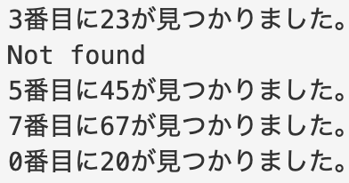
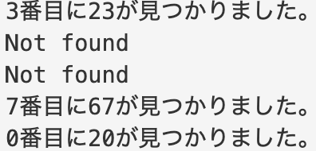

# すごーいスライド


いなたつ

---
はっしゅひょうたんさくってなーに？

---
## ハッシュ表探索ってなんぞや


---
# はいわからん

---
## Hash値 is なに

あらかじめ用意されてる計算式(ハッシュ関数)
を通して得られる結果の値

---
# こんなん

---
# とりまコード書いてみる

---
```
public class Main {
    private static int[] dataTable = {12,23,45,36,71,94,19,67,28,20};
    private static int[] hashTable = {-1,-1,-1,-1,-1,-1,-1,-1,-1,-1};
    public static void main(String[] args) {
        int data,hashedData;
        
        for(int i:dataTable){
            int hashedValue = hashFunc(i);
            hashTable[hashedValue] = i;
        }
        
        search(23);
        search(24);
        search(45);
        search(67);
        search(20);
        
        
    }
    private static int hashFunc(int data){
        return data % 10;
    }
    private static void search(int data){
        int hashedValue = hashFunc(data);
        if(hashTable[hashedValue] == data){
            System.out.println(hashedValue+"番目に"+data+"が見つかりました。");
            return;
        }
        System.out.println("Not found");
    }
    
}

```
---

---
# じゃあ要素を追加してみる
---
```
public class Main {
    private static int[] dataTable = {12,23,45,36,71,94,19,67,28,20,65};
    private static int[] hashTable = {-1,-1,-1,-1,-1,-1,-1,-1,-1,-1};
    public static void main(String[] args) {
        int data,hashedData;
        
        for(int i:dataTable){
            int hashedValue = hashFunc(i);
            hashTable[hashedValue] = i;
        }
        
        search(23);
        search(24);
        search(45);
        search(67);
        search(20);
        
        
    }
    private static int hashFunc(int data){
        return data % 10;
    }
    private static void search(int data){
        int hashedValue = hashFunc(data);
        if(hashTable[hashedValue] == data){
            System.out.println(hashedValue+"番目に"+data+"が見つかりました。");
            return;
        }
        System.out.println("Not found");
    }
    
}
```
---

---
あれれ〜おかしいぞ〜

---
## Hash値が衝突！！
## シノニム

---
# シノニムってなんやねん
---
授業と被って病みました。。。。。
